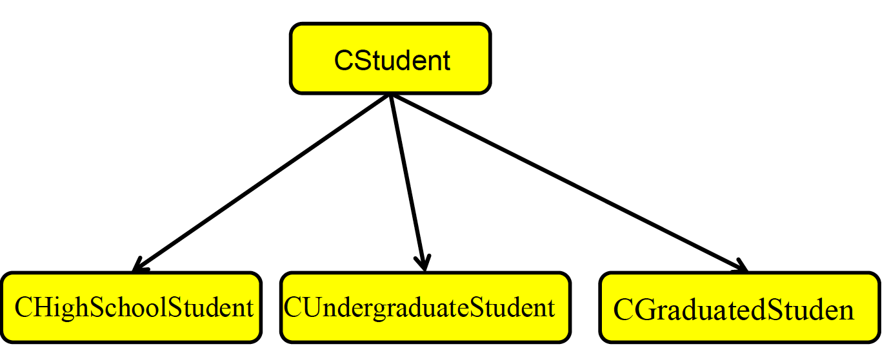
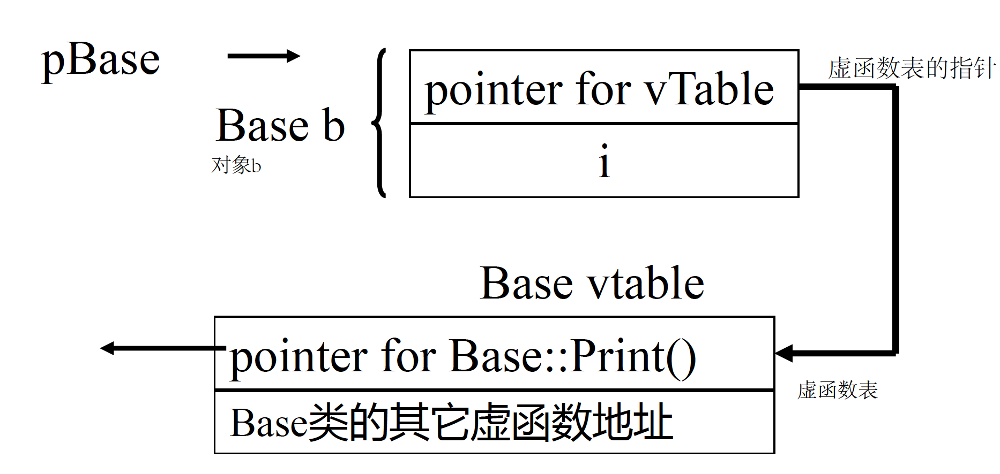
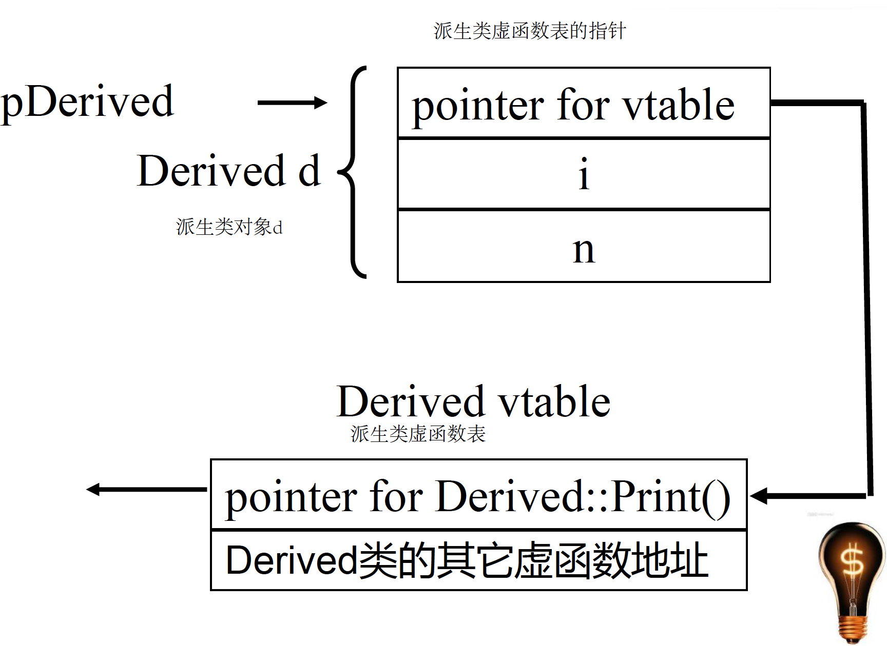

# C++
面向对象的设计：抽象、封装、继承、多态

使用类的成员函数或者变量
- 对象.成员名
- 指针->成员名
- 引用名.成员名
## 构造函数
constructor.cpp
## 复制构造函数
copyconstructor.cpp，只有一个参数，是对同类对象的引用

形如X::X(X&)或X::X(const X&)

默认的复制构造函数完成复制功能
## 析构函数
destructor.cpp

##this指针
指向成员函数所作用的对象，类似于python中的self

**注意:静态成员函数中不能使用this指针，因为静态成员函数并不具体作用与某个对象**

##静态成员
Static.cpp
在定义前面加static关键字的成员,**静态成员变量本质上是全局变量，静态成员函数本质上是全局函数**

**设置静态成员机制的目的是将和某些类紧密相关的全局变量和函数写到类中，易于维护和理解**

1. 普通成员变量每个对象有各自的一份，而**静态成员就一份，为所有的对象共享**，sizeof运算符不会计算静态成员变量。
2. 静态成员函数**并不作用于具体某个对象**
3. 静态成员并不需要通过对象就能访问
   - 类名::成员名
   - 对象名.成员名
   - 指针->成员名
   - 引用名.成员名
  
**注意:**

1. 必须在定义类的文件中对静态成员变量进行一次说明或初始化，否则编译能通过，链接不能通过
2. 静态成员函数中，不能访问非静态成员变量，也不能调用非静态成员函数

## 封闭类和成员对象
有成员对象的类叫封闭(enclosing)类。

**任何生成封闭类对象的语句，都要让编译器明白，对象中的成员对象，是如何初始化的。**

具体的做法就是：
**通过封闭类的构造函数的初始化列表。**
成员对象初始化列表中的参数可以是任意复杂的表达式，可以包括函数，变量，只要表达式中的函数或变量有定义就行。

封闭类构造函数和析构函数的执行顺序
- 封闭类对象生成时，先执行所有对象成员的构造函数，然后才执行封闭类的构造函数。
- 对象成员的构造函数调用次序和对象成员在类中的说明次序一致，与它们在成员初始化列表中出现的次序无关。
- 当封闭类的对象消亡时，先执行封闭类的析构函数，然后再执行成员对象的析构函数。次序和构造函数的调用次序相反。
```
class CTyre {
public:
    CTyre() { cout << "CTyre contructor" << endl; }
    ~CTyre() { cout << "CTyre destructor" << endl; }
};
class CEngine {
public:
    CEngine() { cout << "CEngine contructor" << endl; }
    ~CEngine() { cout << "CEngine destructor" << endl; }
};
class CCar {
private:
    CEngine engine;//成员对象
    CTyre tyre;
public:
    CCar(){ cout << “CCar contructor” << endl;
    ~CCar() { cout << "CCar destructor" << endl; }
};
int main()
{
    CCar car;
    return 0;
}
/*
CEngine contructor
CTyre contructor
CCar contructor
CCar destructor
CTyre destructor
CEngine destructor
*/
``` 
## 常量成员函数
如果不希望某个对象的值被改变，则定义该对象的时候可以在前面加const关键字
常量对象只能使用构造函数、析构函数和有const说明的函数(常量方法）

在类的成员函数说明后面可以加 const 关键字，则该成员函数成为常量成员函数。

常量成员函数内部不能改变属性的值，也不能调用非常量成员函数。常量对象上可以使用常量成员函数。

**在定义常量成员函数和声明常量成员函数时都应该使用const关键字。**

## 继承与派生
- 继承：在定义一个新的类B时，如果该类与某个已有的类A相似(指的是B拥有A的全部特点)那么就可以把A作为一个基类 ，而把B作为基类的一个派生类(也称子类)。
- 派生类是通过对基类进行修改和扩充得到的。在派生类中，可以扩充新的成员变量和成员函数。
- 派生类一经定义后，可以独立使用，不依赖于基类。
- 派生类拥有基类的全部成员函数和成员变量，不是private、protected、public 。
- 在派生类的各个成员函数中，**不能访问基类中的private成员。**

```
class 派生类名: public 基类名
{
...
};
```
派生类对象的体积，等于基类对象的体积，再加上派生类对象自己的成员变量的体积。 **在派生类对象中，包含着基类对象** ，而且基类对象的存储位置位于派生类对象新增的成员变量**之前** 。


类之间的两种关系，继承和封闭类关系
1. 继承："是"关系
   - 基类A,B是基类A的派生类。
   - 逻辑上要求：“一个B对象也是一个A象”。

2. 复合: "有”关系。
   - 类C中"有"成员变量k,k是类D对象，则C 和D是复合关系(封闭类关系，成员对象)
   - 一般逻辑上要求："D对象是C对象的固有属性或组成部" 

### 派生类覆盖基类成员
派生类可以定义一个和基类成员同名的成员，这叫**覆盖** 。在派生类中访问这类成员时，缺省的情况是访问派生类中定义的成员。**要在派生类中访问由基类定义的同名成员时，要使用作用域符号::**。一般来说，基类和派生类不定义同名成员变量。

### 类的保护成员
基类的protected成员：可以被下列函数访问
- 基类的成员函数
- 基类的友元函数
- 派生类的成员函数可以访问当前对象的基类的保护成员
### 派生类的构造函数
- 在创建派生类的对象时，需要调用基类的构造函数：初始化派生类对象中从基类继承的成员。在执行一个派生类的构造函数之前，总是先执行基类的构造函数。
- 调用基类构造函数的两种方式
  - 显式方式：在派生类的构造函数中，为基类的构造函数提供参数derived::derived(arg_derived-list):base(arg_base list)
  - 隐式方式：在派生类的构造函数中，省略基类构造函数时，派生类的构造函数则自动调用基类的默认构造函数
- 派生类的析构函数被执行时，执行完派生类的析构函数后，自动调用基类的析构函数。
### 封闭派生类对象
1. 封闭派生类对象的构造函数执行顺序
   - 先执行基类的构造函数，用以初始化派生类对象中从基类继承的成员；
   - 再执行成员对象类的构造函数，用以初始化派生类对象中成员对象。
   - 最后执行派生类自己的构造函数
2. 封闭派生类对象消亡时析构函数的执行顺序
   - 先执行派生类自己的析构函数
   - 再依次执行各成员对象类的析构函数
   - 最后执行基类的析构函数

析构函数的调用顺序与构造函数的调用顺序相反。
### 继承的赋值兼容规则
1. public
   - 派生类的对象可以赋值给基类对象 
   - 派生类对象可以初始化基类引用
   - 派生类对象的地址可以赋值给基类指针
2. protected继承时，基类的public成员和 protected成员成为派生类的protected成员。
3. private继承时，基类的public成员成为派生类的 private成员，基类的protected成员成为派生类的不可访问成员。
4. protected和private继承不是“是”的关系。
### 基类与派生类的指针强制转换
- 公有派生的情况下 派生类对象的指针可以直接赋值给基类指针
Base * ptrBase = &objDerived;
ptrBase指向的是一个Derived类的对象；
*ptrBase可以看作一个Base类的对象，访问它的public 成员直接通过ptrBase即可，**但不能通过ptrBase访问objDerived对象中属于Derived类而不属于Base类的成员**,(后面的多态和虚继承可以解决这一问题)
- 即便基类指针指向的是一个派生类的对象，也不能通过基类指针访问基类没有，而派生类中有的成员。(后面的多态和虚继承可以解决这一问题)
- 通过强制指针类型转换，可以把 ptrBase 转换成 Derived 类的指针
Base * ptrBase = &objDerived;
Derived *ptrDerived = (Derived * ) ptrBase;
程序员要保证ptrBase 指向的是一个 Derived 类的对象，否则很容易会出错。
## 多态
### 虚函数
- 在类的定义中，前面有virtual关键字的成员函数就是虚函数。
- **virtual关键字只用在类定义里的函数声明中，写函数体时不用。**
### 多态的表现形式
ploymorphism.cpp
1. 指针形式
   - 派生类的指针可以赋给基类指针。
   - 通过基类指针调用基类和派生类中的**同名虚函数**时
     - 若该指针指向一个基类的对象，那么被调用是基类的虚函数
     - 若该指针指向一个派生类的对象，那么被调用的是派生类的虚函数。

这种机制就叫做”多态“
2. 引用形式
  - 派生类的对象可以赋给基类引用
  - 通过基类引用调用基类和派生类中的**同名虚函数**时
     - 若该引用引用的是一个基类的对象，那么被调用是基类的虚函数
     - 若该引用引用的是一个派生类的对象，那么被调用的是派生类的虚函数。
  
这种机制也叫做”多态”。 

**派生类中和基类中虚函数同名同参数表的函数，不加virtual也自动成为虚函数**

### 多态的实现
“多态”的关键在于通过基类指针或引用调用一个虚函数时，编译时不确定到底调用的是基类还是派生类的函数，运行时才确定，这叫 “动态联编” 。

每一个有虚函数的类（或有虚函数的类的派生类）都有一个**虚函数表** ，该类的**任何对象中都放着虚函数表的指针**。虚函数表中列出了该类的**虚函数地址**。多出来的4(8)个字节就是**用来放虚函数表的地址的**。(64位机指针变量为8字节，32位机指针变量为4字节)



多态的函数调用语句被编译成一系列根据基类指针所指向的（或基类引用所引用的）对象中存放的虚函数表的地址，在虚函数表中查找虚函数地址，并调用虚函数的指令。

### 虚析构函数
1. 通过基类的指针删除派生类对象时，通常情况下只调用基类的析构函数。但是，删除一个派生类的对象时，应该先调用派生类的析构函数，然后调用基类的析构函数。
2. 解决办法：**把基类的析构函数声明为virtual**
   - 派生类的析构函数可以virtual不进行声明
   - 通过基类的指针删除派生类对象时，首先调用派生类的析构函数，然后调用基类的析构函数
3. **一般来说，一个类如果定义了虚函数，则应该将析构函数也定义成虚函数。或者，一个类打算作为基类使用，也应该将析构函数定义成虚函数。**

**注意： 不允许以虚函数作为构造函数**

### 纯虚函数和抽象类
纯虚函数：没有函数体的虚函数
```
class A {
private:
        int a;
public:
    virtual void Print( )= 0 ; //纯虚函数
    void fun() {cout << "fun"; }
};
```
包含纯虚函数的类叫抽象类
- 抽象类只能作为基类来派生新类使用，不能创建抽象类的对象

- 抽象类的指针和引用可以指向由抽象类派生出来的类的对象
在抽象类的成员函数内可以调用纯虚函数，但是在构造函数或析构函数内部不能调用纯虚函数。
如果一个类从抽象类派生而来，那么当且仅当它实现了基类中的所有纯虚函数，它才能成为非抽象类。